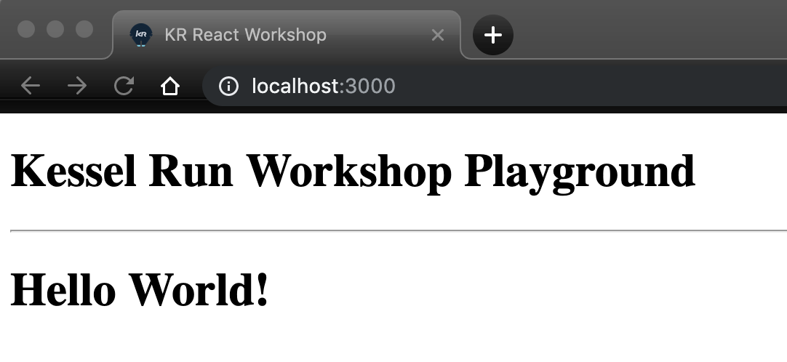

# Challenge # 2


## Setup:
Copy and paste these scripts below the `<div id="root"></div>` line inside `index.html`
```sh
<script src="https://unpkg.com/react@16/umd/react.development.js" crossorigin></script>
<script src="https://unpkg.com/react-dom@16/umd/react-dom.development.js" crossorigin></script>
```
These scripts will grab the react and react-dom dependencies.


Inside `index.html`

Using the React API re-create the same functionality as in Challenge 1.
- Create an h1 component with the text "Hello World!" as it's child.
- Render it to the element with id `root`.

## Goal:

