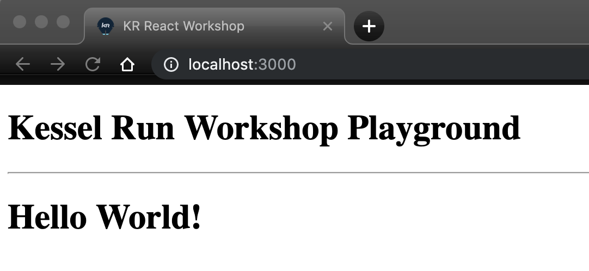

# Challenge # 3

## Setup:
Copy and paste this script below the "`<div id="root"></div>`" line and react dependency scripts inside "`index.html`"
```sh
<script src="https://unpkg.com/@babel/standalone/babel.min.js" crossorigin></script>
```
This script will grab the babeljs transpiler dependency we need.


Inside "`index.html`"

Since we now have a standalone version of babel pulled in.
- Leverage the syntactic sugar JSX provides to recreate the Hello World! h1 tag.

## Hint:
Don't forget to change your script type to "`text/babel`"!

## Goal:

