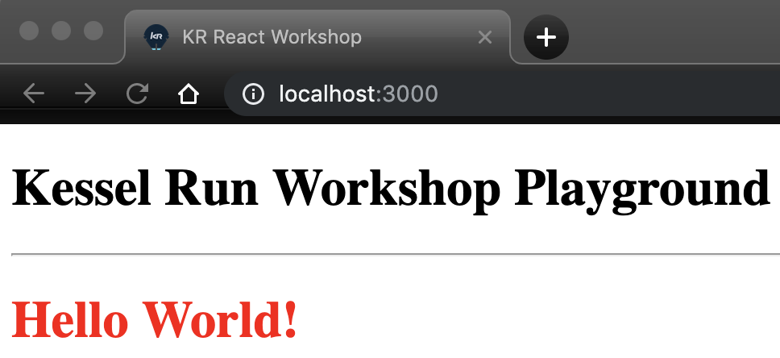

# Challenge # 4

Inside "`index.html`"

- Using JSX syntax, add a color to the "`Hello World`" h1 element.

## Hint:
Remember that since we are using JSX what looks like html syntax\
`<h1>Hello World!</h1>`\
Is actually converted to\
`React.createElement("h1", null, "Hello World!")`\
Therefore the standard methods of adding attributes does not apply does not apply.\
......React.createElement expects an object 

## Goal: (example with red color)
