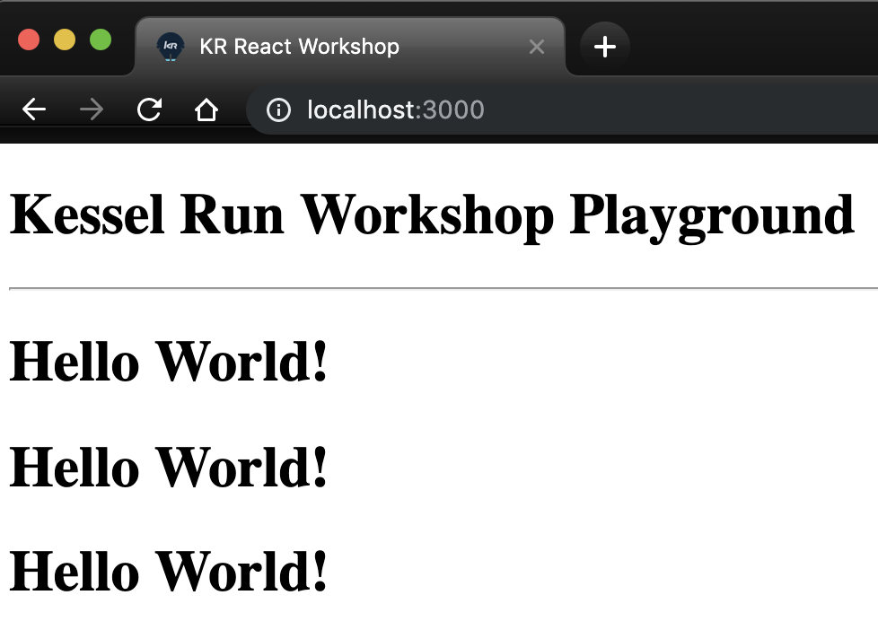
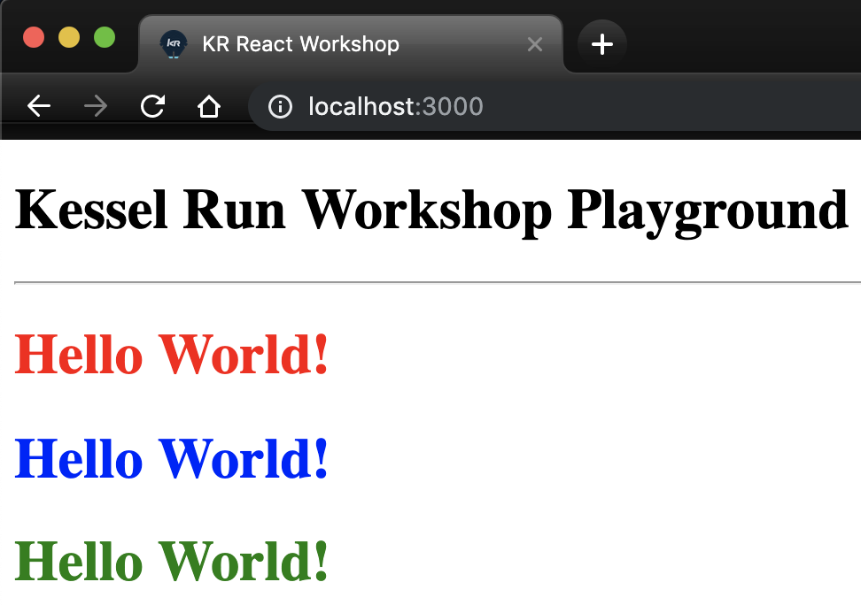
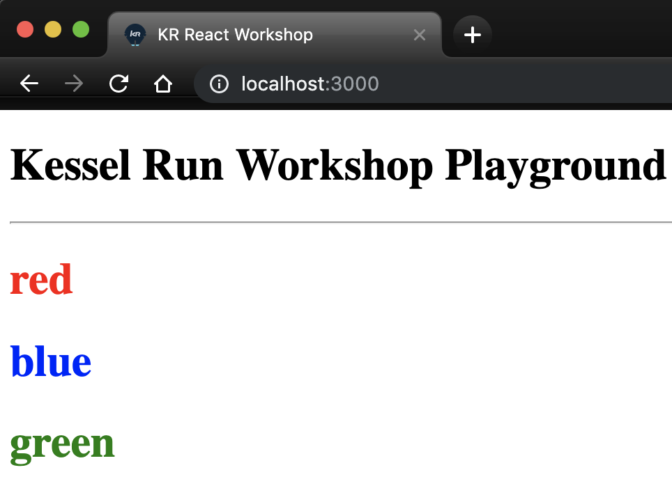

# Challenge # 5

Inside "`index.html`"

- Now that we know a little more about JSX syntax, create a component that is COMPOSED of at least three of these now reusable react elements.

## Hint:
When using JSX, inside curly braces "{ }" you have access to JavaScript.

## Goal:

## Even More: (example with red, blue, green)
Try combining challenge 4 with 5, modifying the component so that it accepts a color string and maybe prints the passed color as a string too?

